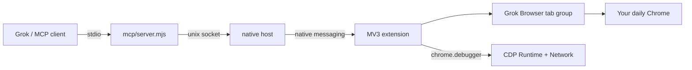

# grok-browser-use

**Drive the Chrome you already logged into** — from Grok, without `--remote-debugging-port`.

让 Grok 操作你正在用的 Chrome：独立标签分组、常驻彗星指针、后台读 console / network。不另起浏览器，也不要求打开远程调试端口。


Chrome 136+ 默认用户目录不再接受 `--remote-debugging-port`。官方 [browser-use](https://github.com/browser-use/plugins) / [chrome-devtools-mcp](https://github.com/ChromeDevTools/chrome-devtools-mcp) 都卡在这条线上。grok-browser-use 走 **MV3 扩展 + native messaging**，接到你已经登录的 profile。

> 非 xAI / OpenAI 官方项目。灵感来自 Codex Chrome 插件的接入方式，实现是独立的。

## ✨ Highlights / 亮点

- **Daily Chrome, not a second profile** — 用你已经登录的 Gmail / 内部后台 / operax，不必再登一遍
- **Grok Browser tab group** — 智能体开的页进独立分组，不和你正在看的标签搅在一起
- **Always-on pointer** — 分组里常驻彗星指针，和系统箭头一眼能分开；不是点一下才闪一下
- **Background CDP** — `Runtime` / `Network` 挂在分组标签上：console（含堆栈）、请求列表、单条 header + body、TTFB/FCP、计算样式。不打开 DevTools 面板
- **wait_for** — 等网络空闲 / console 匹配 / 选择器出现，再截图
- **No 9222** — 不要求 `chrome://inspect/#remote-debugging`

## 🏗 Architecture / 架构



控制面是扩展（分组、指针、点击）。检查面是同一条 `chrome.debugger` 会话，后台读，不切到 Network 面板。

## 🚀 Install / 安装

```bash
git clone https://github.com/LiFeiYu-boost/grok-browser-use.git
cd grok-browser-use
chmod +x host/native-host.sh scripts/*.sh
node scripts/install-host.mjs
```

然后在 Chrome 里：

1. 打开 `chrome://extensions`
2. 打开 **Developer mode**
3. **Load unpacked** → 选仓库里的 `extension/`

扩展 id 应是 `eljkchjmlpfpbobncnnimgfijfcehdja`（由 `extension/key.pem` 钉死，native host 的 allowlist 绑这个 id）。

### 接到 Grok

```bash
ln -s "$(pwd)" ~/.grok/plugins/grok-browser-use
```

新开一个 Grok 会话。MCP 入口是 `.mcp.json` → `scripts/run-mcp.sh`。

## 🧩 What Grok can call / 工具

| 动作 | 工具 |
|------|------|
| 开页 / 点 / 填 / 截图 | `new_tab` `snapshot` `click` `fill` `screenshot` `run_parallel` |
| 等稳 | `wait_for`（networkIdle / consolePattern / selector） |
| 看请求与日志 | `network` `get_network_request` `console` `get_console_message` |
| 性能与样式 | `performance` `css_styles` |

只采集 **Grok Browser** 分组里的标签。不会去翻你飞书、Agency 那些页。

## 🧪 Tests / 测试

```bash
node tests/test-framing.mjs
node tests/spike-native-messaging.mjs   # Chrome for Testing，不动日常 Chrome
node tests/acceptance.mjs
```

`tests/prove-*.mjs` 需要本机已经 Load unpacked，会对日常 Chrome 的 Grok 分组动手。

## 📂 Layout / 目录

```
extension/   MV3：指针、CDP 收集、service worker
host/        Chrome native messaging host
mcp/         MCP stdio server
lib/         broker · 安装 native host
skills/      Grok skill
tests/       单测 + 夹具 + 实机证明
```

## License

MIT。`extension/key.pem` 只用来固定 unpacked 扩展 id，不是云服务密钥。Fork 后若要换 id，自己重新生成一对 key。
