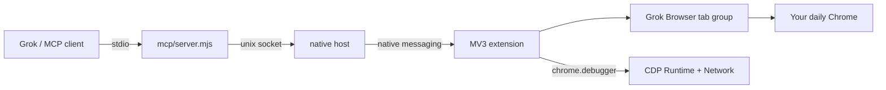

# grok-browser-use

**Drive the Chrome you already logged into** — from Grok, without `--remote-debugging-port`.

**让 Grok 操作你正在用的 Chrome** — 独立标签分组、常驻彗星指针、后台读 console / network。不另起浏览器，也不要求打开远程调试端口。


Chrome 136+ ignores `--remote-debugging-port` on the default user-data-dir. [browser-use](https://github.com/browser-use/plugins) and [chrome-devtools-mcp](https://github.com/ChromeDevTools/chrome-devtools-mcp) both hit that wall. grok-browser-use attaches with an **MV3 extension + native messaging host**, so it can use the profile you already signed into.

Chrome 136+ 默认用户目录不再接受 `--remote-debugging-port`。官方 browser-use / chrome-devtools-mcp 都卡在这条线上。grok-browser-use 走 **MV3 扩展 + native messaging**，接到你已经登录的 profile。

> Not an xAI or OpenAI product. The attach model is inspired by Codex’s Chrome plugin; the implementation is independent.
>
> 非 xAI / OpenAI 官方项目。灵感来自 Codex Chrome 插件的接入方式，实现是独立的。

## ✨ Highlights / 亮点

- **Daily Chrome, not a second profile** — reuse Gmail, internal admin, operax, whatever is already signed in. / 用你已经登录的站点，不必再登一遍
- **Grok Browser tab group** — agent tabs live in their own group and stay off your working strip. / 智能体开的页进独立分组，不和你正在看的标签搅在一起
- **Always-on pointer** — a comet cursor stays on agent pages; it is not a flash on click. / 分组里常驻彗星指针，和系统箭头一眼能分开
- **Background CDP** — `Runtime` + `Network` on those tabs: console (with stacks), request list, one-request headers + truncated body, TTFB/FCP, computed styles. DevTools UI stays closed. / 后台读 console / 请求 / 性能 / 计算样式，不打开 DevTools 面板
- **wait_for** — wait for network idle, a console pattern, or a selector before you screenshot. / 等网络空闲、console 匹配或选择器出现，再截图
- **No port 9222** — you do not have to enable `chrome://inspect/#remote-debugging`. / 不要求打开远程调试

## 🏗 Architecture / 架构



Control (groups, pointer, clicks) goes through the extension. Inspection uses the same `chrome.debugger` session in the background — it does not bring the Network panel to the front.

控制面是扩展（分组、指针、点击）。检查面是同一条 `chrome.debugger` 会话，后台读，不切到 Network 面板。

## 🚀 Install / 安装

```bash
git clone https://github.com/LiFeiYu-boost/grok-browser-use.git
cd grok-browser-use
chmod +x host/native-host.sh scripts/*.sh
node scripts/install-host.mjs
```

Then in Chrome / 然后在 Chrome 里：

1. Open `chrome://extensions`
2. Turn on **Developer mode**
3. **Load unpacked** → choose the `extension/` folder in this repo

The extension id must be `eljkchjmlpfpbobncnnimgfijfcehdja` (pinned by `extension/key.pem`). The native-host allowlist is bound to that id.

扩展 id 应是 `eljkchjmlpfpbobncnnimgfijfcehdja`（由 `extension/key.pem` 钉死，native host 的 allowlist 绑这个 id）。

### Wire it into Grok / 接到 Grok

```bash
ln -s "$(pwd)" ~/.grok/plugins/grok-browser-use
```

Start a **new** Grok session. The MCP entry is `.mcp.json` → `scripts/run-mcp.sh`.

新开一个 Grok 会话。MCP 入口是 `.mcp.json` → `scripts/run-mcp.sh`。

## 🧩 What Grok can call / 工具

| Action / 动作 | Tools / 工具 |
|------|------|
| Open, click, type, screenshot / 开页、点、填、截图 | `new_tab` `snapshot` `click` `fill` `screenshot` `run_parallel` |
| Wait until stable / 等稳 | `wait_for` (`networkIdle` / `consolePattern` / `selector`) |
| Requests and logs / 请求与日志 | `network` `get_network_request` `console` `get_console_message` |
| Perf and CSS / 性能与样式 | `performance` `css_styles` |

Collection is limited to the **Grok Browser** group. Your Feishu / Agency tabs are left alone.

只采集 **Grok Browser** 分组里的标签，不会去翻你正在用的其它页。

## 🧪 Tests / 测试

```bash
node tests/test-framing.mjs
node tests/spike-native-messaging.mjs   # Chrome for Testing; does not touch daily Chrome / 不动日常 Chrome
node tests/acceptance.mjs
```

`tests/prove-*.mjs` need the unpacked extension already loaded. They will operate the Grok group in your daily Chrome.

`tests/prove-*.mjs` 需要本机已经 Load unpacked，会对日常 Chrome 的 Grok 分组动手。

## 📂 Layout / 目录

```
extension/   MV3 pointer, CDP collector, service worker
host/        Chrome native messaging host
mcp/         MCP stdio server
lib/         broker · native-host install
skills/      Grok skill
tests/       unit tests, fixtures, live proofs
```

## License

MIT. `extension/key.pem` only pins the unpacked extension id for native messaging — it is not a cloud credential. Fork and generate a new key pair if you need a different id.

MIT。`extension/key.pem` 只用来固定 unpacked 扩展 id，不是云服务密钥。Fork 后若要换 id，自己重新生成一对 key。
