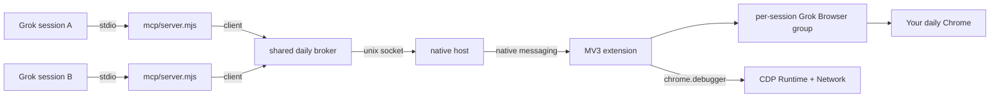

# grok-browser-use

**[English](README.md)** · **[简体中文](README.zh-CN.md)**

**Drive the Chrome you already logged into** — from Grok, without `--remote-debugging-port`.


Chrome 136+ ignores `--remote-debugging-port` on the default user-data-dir. [browser-use](https://github.com/browser-use/plugins) and [chrome-devtools-mcp](https://github.com/ChromeDevTools/chrome-devtools-mcp) both hit that wall. grok-browser-use attaches with an **MV3 extension + native messaging host**, so it can use the profile you already signed into.

> Not an xAI or OpenAI product. The attach model is inspired by Codex’s Chrome plugin; the implementation is independent.

## Highlights

- **Daily Chrome, not a second profile** — reuse Gmail, internal admin, operax, whatever is already signed in
- **Grok Browser tab group** — agent tabs live in their own group and stay off your working strip
- **Always-on pointer** — a comet cursor stays on agent pages; it is not a flash on click
- **Background CDP** — `Runtime` + `Network` on those tabs: console (with stacks), request list, one-request headers + truncated body, TTFB/FCP, computed styles. DevTools UI stays closed
- **wait_for** — wait for network idle, a console pattern, or a selector before you screenshot
- **Safe clicks** — snapshot marks logout/delete as `destructive`; CDP mouse events, not synthetic `el.click()`
- **No port 9222** — you do not have to enable `chrome://inspect/#remote-debugging`

## Architecture



Daily Chrome has **one broker per machine** (`run/daily.sock`). Every Grok session’s MCP process is a client of that hub. Each session gets its own tab group (`Grok Browser · <id>` from `GROK_SESSION_ID`) and by default only operates those tabs. CfT tests still use a per-pid socket.

Control (groups, pointer, clicks) goes through the extension. Inspection uses the same `chrome.debugger` session in the background — it does not bring the Network panel to the front.

## Install

```bash
git clone https://github.com/LiFeiYu-boost/grok-browser-use.git
cd grok-browser-use
chmod +x host/native-host.sh scripts/*.sh
node scripts/install-host.mjs
```

Then in Chrome:

1. Open `chrome://extensions`
2. Turn on **Developer mode**
3. **Load unpacked** → choose the `extension/` folder in this repo

The extension id must be `eljkchjmlpfpbobncnnimgfijfcehdja` (pinned by `extension/key.pem`). The native-host allowlist is bound to that id.

### Wire it into Grok

```bash
ln -s "$(pwd)" ~/.grok/plugins/grok-browser-use
```

Start a **new** Grok session. The MCP entry is `.mcp.json` → `scripts/run-mcp.sh`.

Grok also loads **`skills/grok-browser-use/SKILL.md`** from this plugin (tab group, pointer, destructive clicks, fallback to chrome-devtools). If the plugin is awkward or broken while Grok is using it, that skill tells Grok to open an issue on this repo.

## What Grok can call

| Action | Tools |
|------|------|
| Open, click, type, screenshot | `new_tab` `snapshot` `click` `fill` `screenshot` `run_parallel` |
| Hover, scroll, select | `hover` `scroll` `select_option` |
| Wait until stable | `wait_for` (`networkIdle` / `consolePattern` / `selector`); `click` / `screenshot` wait by default |
| Requests and logs | `network` `get_network_request` `console` `get_console_message` |
| Perf and CSS | `performance` `css_styles` |

Logout / delete controls are marked `destructive` in `snapshot`. `click` refuses them unless you pass `confirmDestructive: true`. MCP stays up if the extension is asleep (`status.connectionState`).

Collection is limited to the **Grok Browser** group. Your other tabs are left alone.

## Tests

```bash
node tests/test-framing.mjs
node tests/prove-singleton-broker.mjs   # shared daily hub; does not touch Chrome
node tests/prove-session-groups.mjs     # per-session tab groups; does not touch Chrome
node tests/spike-native-messaging.mjs   # Chrome for Testing; does not touch daily Chrome
node tests/acceptance.mjs
```

`tests/prove-*.mjs` need the unpacked extension already loaded. They will operate the Grok group in your daily Chrome.

## Layout

```
extension/   MV3 pointer, CDP collector, service worker
host/        Chrome native messaging host
mcp/         MCP stdio server
lib/         broker · native-host install
skills/      Grok skill
tests/       unit tests, fixtures, live proofs
```

## License

MIT. `extension/key.pem` only pins the unpacked extension id for native messaging — it is not a cloud credential. Fork and generate a new key pair if you need a different id.
