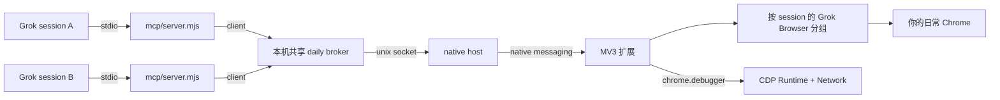

# grok-browser-use

**[English](README.md)** · **[简体中文](README.zh-CN.md)**

**让 Grok 操作你正在用的 Chrome** — 不需要 `--remote-debugging-port`。


独立标签分组、常驻彗星指针、后台读 console / network。不另起浏览器，也不要求打开远程调试端口。

Chrome 136+ 默认用户目录不再接受 `--remote-debugging-port`。[browser-use](https://github.com/browser-use/plugins) 和 [chrome-devtools-mcp](https://github.com/ChromeDevTools/chrome-devtools-mcp) 都卡在这条线上。grok-browser-use 走 **MV3 扩展 + native messaging**，接到你已经登录的 profile。

> 非 xAI / OpenAI 官方项目。灵感来自 Codex Chrome 插件的接入方式，实现是独立的。

## 亮点

- **日常 Chrome，不是第二套配置** — 用你已经登录的 Gmail、内部后台、operax，不必再登一遍
- **Grok Browser 标签分组** — 智能体开的页进独立分组，不和你正在看的标签搅在一起
- **常驻指针** — 分组里常驻彗星指针，和系统箭头一眼能分开；不是点一下才闪一下
- **后台 CDP** — 在这些标签上挂 `Runtime` + `Network`：console（含堆栈）、请求列表、单条 header + 截断 body、TTFB/FCP、计算样式。不打开 DevTools 面板
- **wait_for** — 等网络空闲、console 匹配或选择器出现，再截图
- **安全点击** — snapshot 把退出登录 / 删除标成 `destructive`；点击走 CDP 鼠标事件，不是假的 `el.click()`
- **不需要 9222** — 不必打开 `chrome://inspect/#remote-debugging`

## 架构



日常 Chrome **整机只有一个 broker**（`run/daily.sock`）。每个 Grok session 的 MCP 都是这个 hub 的客户端。每个 session 自己的标签组（`Grok Browser · <id>`，来自 `GROK_SESSION_ID`），默认只操作自己开的标签。CfT 测试仍用按 pid 隔离的 socket。

控制面（分组、指针、点击）走扩展。检查面用同一条 `chrome.debugger` 会话在后台读，不会把 Network 面板拉到前台。

## 安装

```bash
git clone https://github.com/LiFeiYu-boost/grok-browser-use.git
cd grok-browser-use
chmod +x host/native-host.sh scripts/*.sh
node scripts/install-host.mjs
```

然后在 Chrome 里：

1. 打开 `chrome://extensions`
2. 打开 **Developer mode**
3. **Load unpacked** → 选仓库里的 `extension/` 文件夹

扩展 id 应是 `eljkchjmlpfpbobncnnimgfijfcehdja`（由 `extension/key.pem` 钉死）。native host 的 allowlist 绑这个 id。

### 接到 Grok

```bash
ln -s "$(pwd)" ~/.grok/plugins/grok-browser-use
```

**新开**一个 Grok 会话。MCP 入口是 `.mcp.json` → `scripts/run-mcp.sh`。

安装后 Grok 会加载本仓库的 **`skills/grok-browser-use/SKILL.md`**（分组、指针、危险按钮、chrome-devtools 仅作 fallback）。Grok 用这个插件时如果觉得不顺手或有故障，会按 skill 给本仓库提 issue。

## Grok 可以调用的工具

| 动作 | 工具 |
|------|------|
| 开页、点、填、截图 | `new_tab` `snapshot` `click` `fill` `screenshot` `run_parallel` |
| 悬停、滚动、下拉 | `hover` `scroll` `select_option` |
| 等稳 | `wait_for`（`networkIdle` / `consolePattern` / `selector`）；`click` / `screenshot` 默认会等 |
| 请求与日志 | `network` `get_network_request` `console` `get_console_message` |
| 性能与样式 | `performance` `css_styles` |

退出登录 / 删除一类控件在 `snapshot` 里会标 `destructive`。`click` 默认拒绝，除非传入 `confirmDestructive: true`。扩展睡着时 MCP 进程不会退出（看 `status.connectionState`）。

只采集 **Grok Browser** 分组里的标签，不会去翻你正在用的其它页。

## 测试

```bash
node tests/test-framing.mjs
node tests/spike-native-messaging.mjs   # Chrome for Testing，不动日常 Chrome
node tests/acceptance.mjs
```

`tests/prove-*.mjs` 需要本机已经 Load unpacked，会对日常 Chrome 的 Grok 分组动手。

## 目录

```
extension/   MV3 指针、CDP 收集、service worker
host/        Chrome native messaging host
mcp/         MCP stdio 服务
lib/         broker · 安装 native host
skills/      Grok skill
tests/       单测、夹具、实机证明
```

## 许可证

MIT。`extension/key.pem` 只用来固定 unpacked 扩展 id，不是云服务密钥。Fork 后若要换 id，自己重新生成一对 key。
